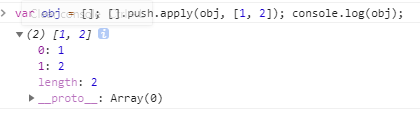

# [].push.call和[].push.apply的区别
&emsp;&emsp;区别在于第二个参数，假如有如下代码：
```javascript
var obj = {};
[].push.call(obj, [1,2]);
[].push.apply(obj, [1,2]);
```
使用call调用时，push会将第二个参数当成一个整体来push进去，最终结果如下：


使用apply调用时，会把第二个参数当成是数组，然后将该数组中的元素一个个push进去，如下：



ps:上面代码中使用push可以将真数组转成伪数组，也可以将伪数组转伪数组。但后者在IE8中及以下浏览器中会出现报错。所以为了兼容，可以先将伪数组转为真数组，再将使用push将真数组转伪数组。如下：
```javascript
//传入的是数组，无论是真数组还是伪数组，都会将数组中的每项存入JQuery对象中并返回
      if(typeof selector === 'object' && 'length' in selector && selector !== window) {
        //由于IE8及以下版本的push.apply()中第二个参数如果是自定义伪数组则会报错
        //为了兼容性，统一转为真数组后再转换成伪数组
        var tempArr = [].slice.apply(selector);
        [].push.apply(this, tempArr);
        return this;
      }
```
# 判断变量是否是数组的几种方法
## 方案一：instanceof
```javascript
var a = [];
a instanceof Array;
```
## 方案二：toString
```javascript
var a = [];
Object.prototype.toString.call(a).indexOf('Array');
```

## 方案三：isPrototypeOf()
&emsp;&emsp;判断某对象是否处于另一个对象的原型链上。比如：
```javascript
var a = [];
Array.prototype.isPrototypeOf(a);
```
表示判断Array.prototype是否处于对象a的原型链上，也就是可以判断a是否是数组。
## 方案四：构造函数constructor
```javascript
var a = [];
a.contructor.toString().indexOf('Array');
```

## 方案五：isArray方法
```javascript
var a = [];
Array.isArray(a);
```
# in关键字
&emsp;&emsp;用来判断某个属性是否存在于某个对象中，无论这个对象是实例还是原型,in关键字会在整条原型链中查找。通常配合hasOwnProperty可以实现判断某属性是在实例上还是对象上。如下：
```javascript
function hasPrototypeProperty(object, property){
  return !object.hasOwnProperty(property) && property in object
}
```

# JQuery中的extend方法
&emsp;&emsp;随着自己编写的简易版jquery越来越大，封装的静态方法(JQuery.xxx)也越来越多，造成难以管理和维护，此时可使用extend方法来管理这些方法。如下：

&emsp;&emsp;只需要将方法以键值对传递给extend即可。JQuery.extend将方法注册到JQuery上，这样外界可以通过$.xxxx来使用这些方法；JQuery.prototype.extend将方法注册到JQuery的原型上，这样外界可以通过JQuery实例.xxxx的方式来使用这些方法。

# JQuery入口函数-函数处理
&emsp;&emsp;给JQuery的入口函数的参数为一个函数时，这个回调函数会在DOM加载(此时页面的其他资源不一定加载完毕)完毕后被调用，所以这个回调并不是绑定在onload事件上的。


&emsp;&emsp;addEventListener事件监听，DOM2级标准中的方法，IE8及其以下版本不支持，使用attachEvent代替(不支持事件捕获)。


&emsp;&emsp;DOMContentLoaded事件，IE8及以下版本不支持。使用readyState属性和onreadystatechange方法来替代。

综上，实现对代码如下：
```javascript
ready: function (fn) {
      if(document.readyState === 'complete') {
        fn;
      } else if(document.addEventListener){
        document.addEventListener('DOMContentLoaded', fn);
      } else if (document.attachEvent){
        // IE <= 8
        document.attachEvent('onreadystatechange', function (){
          if (document.readyState === 'complete') {
            fn();
          }
        })
      }
    }
```
# JQuery中each方法的实现
```javascript
each: function (obj, fn) {
      if (obj == null) return;

      if (JQuery.isArray(obj)) {
        //数组处理
        for (var i = 0; i < obj.length; i++) {
          var ret = fn.call(obj[key], i, obj[i]);
          if (ret === true) {
            continue;
          } else if (ret === false) {
            break;
          }
        }
      } else {
        //对象处理
        for (var key in obj) {
          var ret = fn.call(obj[key], key, obj[key]);
          if (ret === true) {
            continue;
          } else if (ret === false) {
            break;
          }
        }
      }
    }
```

# Jquery中的attr和porp方法
## 1.attr操作的是属性节点值，prop操作的是属性值
什么是属性节点值，什么是属性值呢？看下图：

图中通过watch中添加querySelector选出一个dom元素来查看，图中打印出来的都是属性值，也就是节点的属性。而其中的attributes就是属性节点值，是一个类数组。当我们通过setAttrubute方法或者在html中设置(div class="box")属性时，设置的属性和值就会保存在属性节点中而不是属性中。

## 2. 对于一些特殊属性，比如单选框的check属性：
* 如果单选框被选中时，attr('checked')返回的是checked；而prop('checked')返回的是true.
* 如果单选框未被选中，attr('checked')返回的是undefined；而prop返回的是false。
* 对于一个input文本输入框，当使用attr和prop分别获取value值时，前者只能够获取到默认值，也就是说如果我们输入了文本改变了value的值，那么attr获取到的还是默认值，而prop可以获取到改变后的值。

综上，在对于例如checked这些特殊属性时，使用prop更好。
## 3. 对于自定义的属性值
&emsp;&emsp;对于自定义的属性值，prop会返回undefined，也就是prop获取不到自定义的属性，而attr可以获取得到。

# window.getComputedStyle兼容性
&emsp;&emsp;使用getComputedStyle方法可以获取到指定元素的样式，无论是内联样式，内部样式和外部样式。但是该方法在IE8及以下浏览器中不支持，此时使用currentStyle来替代。

# 解决IE8及以下版本浏览器中多个同类型事件绑定后执行顺序问题
&emsp;&emsp;我们知道IE8这lowB浏览器中是不支持用addEventListener方法来绑定事件的。只能使用attachEvent来绑定事件，当attachEvent独特的地方在于，当使用它给同类型事件绑定多个方法时，事件触发后，这些方法的执行顺序是与绑定时的顺序反过来的，也就是后绑定的先执行，先绑定的后执行。

&emsp;&emsp;解决这种与addEventListener表现不一致问题，需要使用事件缓存手段来解决。思路为：
1. 给要触发事件的dom元素添加一个事件缓存对象eventCache
2. 绑定事件处理方法时，往该对象的相应事件类型里面去push处理方法，如eventCache['click'].push(eventHandle)
3. 触发事件时，遍历eventCache里面对应的事件类型里面存的处理方法即可，用addEventListener绑定的就正向遍历，而用attachEvent绑定的则反向遍历，达到表现一致的目的。

据此，可实现一个类似JQuery中的on方法，如下：
```javascript
on: function (name, handler) {
      this.each(function (index, elem) {

        //判断有无事件缓存，无则创建
        if (!elem.eventCache) {
          elem.eventCache = {};
        }

        //判断事件缓存对象中有无相应事件的缓存数组，无则创建
        if (!elem.eventCache[name]) {
          elem.eventCache[name] = [];

          //绑定相应的事件处理函数
          if (elem.addEventListener) {
            elem.addEventListener(name, function (e) {
              $.each(elem.eventCache[name], function (index, item) {
                item.call(elem, e);
              })
            })
          } else if (elem.attachEvent) {
            elem.attachEvent(`on${name}`, function (e) {
              for (var i = elem.eventCache[name].length - 1; i >= 0; i--) {
                elem.eventCache[name][i].call(elem, e);
              }
            })
          }
        }

        //往响应事件缓存里面添加处理函数
        elem.eventCache[name].push(handler);
      })
    }
    ```


